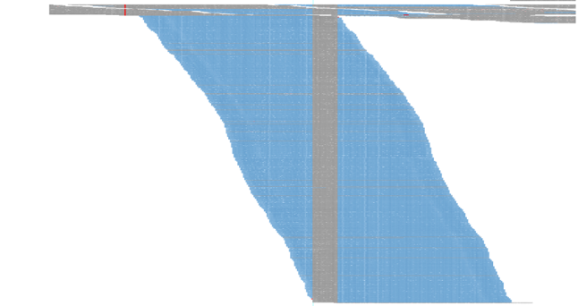
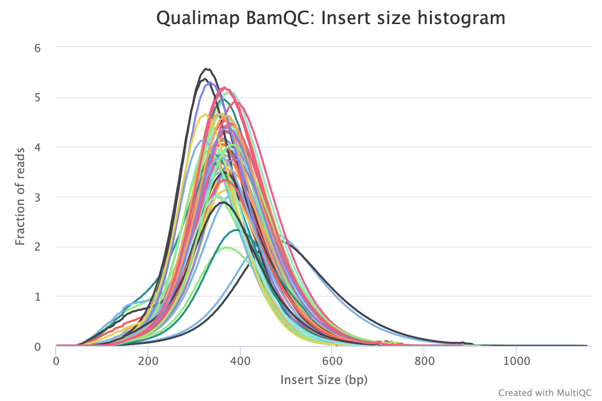
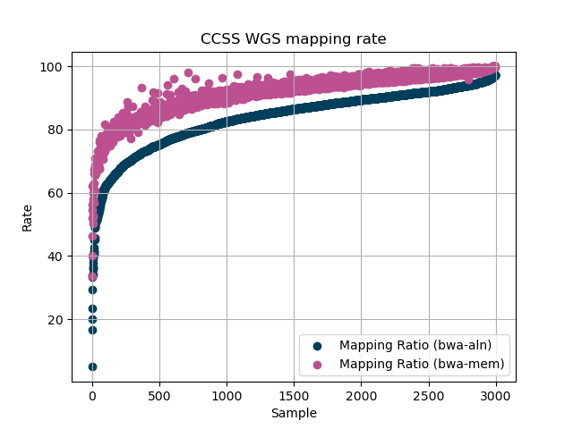
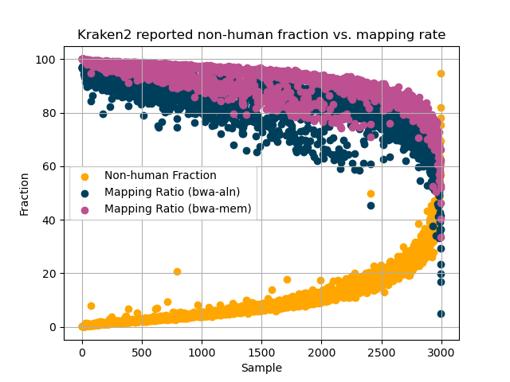

## Background

Pediatric cancer is a rare disease. With improvements in treatment, the number of survivors of childhood cancer continues to increase. However, survivorship carries its own difficulties. In order to study these challenges, studies like CCSS and the St. Jude Lifetime cohort have been established to track and research survivorship. In order to understand the long-term effects of treatment for pediatric cancers, St. Jude in partnership with CCSS members set out to sequence genomic material from childhood cancer survivors. To maximize the number of participants, genetic material was source through saliva collection kits that could be sent by mail to participants and returned to study organizers. From the 2998 participants, whole-genome (WGS) and whole-exome (WES) sequencing data were generated. Pilot studies and external publications showed that saliva-based sequencing could be of comparable quality to traditional blood-derived sequencing. To our knowledge, CCSS is the largest cohort of saliva-based samples collected to date.

## Overview

Childhood Cancer Survivor Study (CCSS) is a germline-only Data Set consisting of whole genome sequencing of childhood cancer survivors. CCSS is a multi-institutional, multi-disciplinary, NCI-funded collaborative resource established to evaluate long-term outcomes among survivors of childhood cancer. It is a retrospective cohort consisting of >24,000 five-year survivors of childhood cancer who were diagnosed between 1970-1999 at one of 31 participating centers in the U.S. and Canada. The primary purpose of this sequencing of CCSS participants is to identify all inherited genome sequence and structural variants influencing the development of childhood cancer and occurrence of long-term adverse outcomes associated with cancer and cancer-related therapy. 

## Bacterial Contamination

Samples for the Childhood Cancer Survivorship Study were collected by sending out Buccal swab kits to enrolled participants and having them complete the kits at home. This mechanism of collecting saliva and buccal cells for sequencing is highly desirable because of its non-invasive nature and ease of execution. However, collection of samples in this manner also has higher probability of contamination from external sources (as compared to, say, samples collected using blood). We have observed samples in this cohort which suffer from bacterial contamination. To address this issue, we have taken the following steps:

1. We have estimated the bacterial contamination rate and annotated each of the samples in the CCSS cohort. For each sample, you will find the estimated contamination rate in the `Description` field of the `SAMPLE_INFO.txt` file that is vended with your data (and as a property on the DNAnexus file). For information on this field, see the [Metadata specification](../metadata-and-clinical#metadata).
2. We have provided the `BAM` file as aligned with `bwa aln` with default parameters. We have observed that there are instances of reads originating from bacterial contamination that are erroneously mapped to the human genome when using `bwa mem` and display a *very* low mapping quality. There may be some reads erroneously aligned and we have kept these as they were aligned and have not made any attempt to unmap these reads. Any analysis you perform on these samples will need to take this into account!

With any questions on the nature or implications of this warning, please contact us at [support@stjude.cloud](mailto:support@stjude.cloud).

### Identification of bacterial contamination

Bacterial contamination manifests as a lower mapping rate than expected, particularly when using `bwa-aln`. Bacterial reads tend to have very short alignments, with large regions of soft clipping. As shown below, these reads have minimal similarity to the human reference genome. This manifestation of bacterial sequence in saliva-derived sequencing has been reported [previously](https://doi.org/10.1038/s41598-020-76022-4). 

In addition to short alignments, the reads in a pair sourced from bacteria tend to align on top of one another. This is evident when looking at distributions of insert sizes with the cohort. The below figure shows the [Qualimap](https://doi.org/10.1093/bioinformatics/bts503) reported insert size for 47 `bwa-mem` aligned samples within the CCSS cohort. The large peak at 19bp is abnormal for WGS data. The reads from bacterial genomes are presenting as atypical alignments where both mates in the read pair contain the same short match to the human reference genome and are aligning at the same spot, yielding a small insert size calculation.

In contrast, a "normal" insert size histogram from the August 2022 batch of RTCG samples is presented below. Here, the insert size distribution is centered around 400bp and there is no large peak at 19bp.

### Selection of bwa-aln

Prior to releasing CCSS data on St. Jude Cloud, the original `bwa-aln` aligned BAMs were reprocessed using our standard harmonization pipeline. However, a quality control analysis of the resulting files demonstrated that the `bwa-mem` aligner was prone to spurious alignments of reads of bacterial origin.

In the figure below, the 2998 WGS samples of CCSS are ordered by their alignment rate with `bwa-aln`. The plot includes the matched alignment percentage from the `bwa-mem` aligner for comparison. For all samples in the cohort, `bwa-mem` more aggressively aligns reads yielding a higher alignment rate, though many of the extra alignments are of poor quality.

In the figure below, the `bwa-mem` and `bwa-aln` alignment rates are plotted for each WGS sample in CCSS. The fraction of reads not labeled as of human origin from [kraken2](https://doi.org/10.1186/s13059-019-1891-0) is also plotted. Both aligners show diminished alignment rates in the presence of bacterial contamination, however `bwa-mem` consistently aligns a higher proportion of reads of dubious origin.

