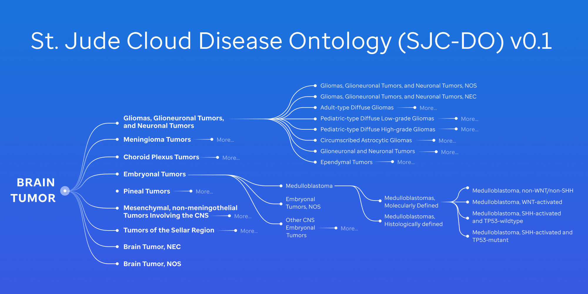
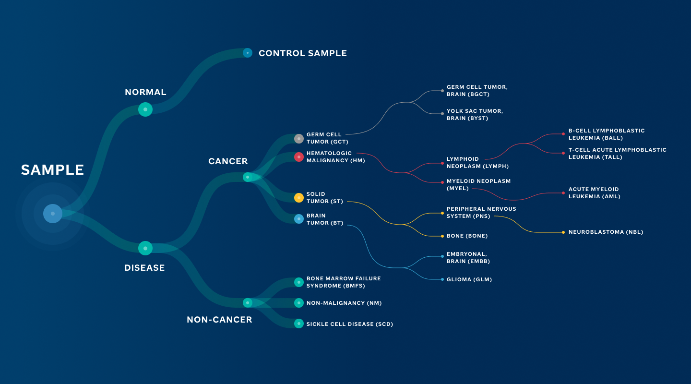

# The St. Jude Cloud Pediatric Cancer Classification Ontology: An Evolving Framework  

Click [here](https://permalinks.stjude.cloud/permalinks/st-jude-cloud-disease-ontology) to download the full St. Jude Cloud Disease Ontology (SJC-DO) v0.1.

## v0.1

Submitted: January 24, 2025

The St. Jude Cloud Disease Ontology (SJC-DO) is a resource for harmonizing pediatric cancer data.
We recently updated the brain tumor classifications to align with the [WHO CNS5 Blue Book guidelines](https://tumourclassification.iarc.who.int/welcome/) 1, 2 and re-annotated 2,587 brain tumor samples in the St. Jude Cloud's [Genomics Platform](https://platform.stjude.cloud/) and soon, [PeCan Knowledge Base](https://pecan.stjude.cloud/).

## Comprehensive Updates

- Reorganized Diffuse High-Grade Glioma (HGG) and Encapsulating Low-Grade Glioma (LGG) categories into a unified parent node: Gliomas, Glioneuronal Tumors, and Neuronal Tumors, including Ependymal Tumor classifications.
- Expanded to include molecular subtypes, enabling more granular classification and precise sample stratification.
  These are seen in the Pediatric High-Grade Glioma and Pediatric Low-Grade Glioma nodes.
- Re-organized Medulloblastoma into _molecularly defined_ vs _histologically defined_ nodes, given the nature of medulloblastoma’s heterogeneity.
  Also, Medulloblastoma, Group 3 and Medulloblastoma, Group 4 have been re-classified under Medulloblastoma, non-WNT/non-SHH to align with WHO CNS5 guidelines.
- We have new defined classifications, such as CIC-rearranged Sarcoma and Dysembryoplastic Neuroepithelial Tumors.
- Added entries for NOS/NEC, addressing assay-dependent classification gaps and ensuring that samples are systematically categorized even when data is incomplete.
- The v0.1 ontology now consists of 80 nodes (reduced from 94) and expands to five layers (see **Figure1** below).

## Challenges

The hierarchical presentation of diseases in the CNS5 guidelines lent itself readily to translation into our tree structure.
However, there were cases where the modeling was not completely straightforward.
Here we describe some of the challenges and the approach we took to each.

The WHO CNS5 blue book lays out definitions for not-otherwise-specified (NOS) and not-elsewhere-classified (NEC) that clearly distinguish the terms and allow application of them to any disease term having subtypes.
However, there is an explicit combined NOS/NEC term for embryonal tumors, CNS Embryonal Tumor NEC/NOS.
To ensure consistent handling of NOS/NEC terms in our ontology, we added explicit and separate NOS and NEC nodes for every non-leaf node.
In the case of CNS Embryonal Tumor NEC/NOS, we included this node but treated it as an NEC node when biomarker data was available.
In cases where biomarker information was unavailable and a sample could not be mapped to Embryonal Tumor subtypes, those samples were mapped to Embryonal Tumors, NOS, adhering to the comprehensive NOS/NEC framework.

The tree structure itself presents challenges, such as the non-nested presentation for Posterior Fossa and subtypes, Posterior Fossa A and Posterior Fossa B.
We elected to model these as three sibling nodes in our tree, mirroring the presentation in the blue book.
Similarly, Supratentorial Ependymoma and its non-nested ZFTA and YAP1 subtypes were modeled as siblings.
While this structure aligns with the presentation of these terms in WHO CNS5, in a future version we will likely nest these subtypes under the parent nodes.
When classifying our posterior fossa samples, because methylation profiling data is not yet available to differentiate between A and B, we mapped these samples directly to Posterior Fossa.
This approach is informative, as it distinguishes them from other ependymal tumor types like Myxopapillary or Supratentorial.
Until methylation profiling data becomes available, all Posterior Fossa samples remain classified under the broader Posterior Fossa category.

In other cases, such as Atypical Teratoid/Rhabdoid Tumor (ATRT), the blue book entry describes subtypes but embeds the subtype classifications within the descriptive text of the entry, reducing clarity.
Following this structure, we mapped ATRT subtypes similarly without creating separate child nodes.
Given the small sample size for these subtypes, we opted to roll them back to the broader ATRT term.
Subtype biomarkers are provided if further classification becomes necessary in the future.

Embryonal tumors, particularly Medulloblastoma, introduce complexity with separate molecular and histological branches, raising uncertainty about whether these branches inherently indicate NOS/NEC logic.
To address this, we mapped samples to child leaf nodes, treating parent nodes as aggregates.
Samples were classified into one of the four molecularly defined nodes based on subtype biomarker data or directly to the “Medulloblastoma, Histologically Defined” node, such as samples previously classified as “Large Cell Medulloblastoma” in our v0 ontology.

In conclusion, while we aimed to align closely with the WHO CNS5 structure to maintain consistency, there were cases that required making modeling decisions that involved trade-offs between competing priorities.
Time may reveal better approaches to some of these challenges, yielding updates to the ontology.
Additionally, as new cases emerge and the transition to CNS6 occurs, the ontology will need to evolve further.

## Future Updates

Building on the advancements in v0.1, we aim to further refine and expand the St. Jude Cloud Disease Ontology to address gaps and enhance scalability.
Immediate priorities include updating hematological diseases, particularly Acute Myeloid Leukemia (AML), and incorporating updated solid tumor classifications.
These efforts will focus on creating consistent parent-child hierarchies and applying the NOS/NEC logic comprehensively across these domains.

In tandem, we are developing a pilot for an Encyclopedia of Composable Characteristics (ECC).
This publicly available resource found on GitHub 3, 4 will prioritize the decoupling of key molecular, histological, and other evidence into independently assignable attributes.
Future versions of the ontology will include rigorous mappings from ECC to ontology terms.
By adopting this composable approach, we aim to minimize disruptions during future updates, support dynamic classifications, and empower other ontologies to be applied.

With each iteration, we aim to align the ontology more closely with cutting-edge research needs while maintaining robust pathways for incomplete or ambiguous cases.
This commitment to continuous improvement ensures the St. Jude Cloud Disease Ontology (SJC-DO) remains a vital resource for the global research community, enabling seamless data harmonization and driving new discoveries in pediatric oncology.

**Figure 1**: St. Jude Cloud Disease Ontology (SJC-DO) v0.1 aligning to the WHO CNS5 guidelines.

### References

1. [https://tumourclassification.iarc.who.int/](https://tumourclassification.iarc.who.int/)
2. [https://pmc.ncbi.nlm.nih.gov/articles/PMC8328013/](https://pmc.ncbi.nlm.nih.gov/articles/PMC8328013/)
3. [https://github.com/stjudecloud/ecc](https://github.com/stjudecloud/ecc)
4. [https://github.com/stjudecloud/ontology](https://github.com/stjudecloud/ontology)

---

## v0.0

Submitted: May 14, 2024

Ontologies designed for disease classification have redefined our understanding of diseases by providing a hierarchical structure of complex biomedical data.
In cancer research, they are critical for data sharing, integration, and collaboration among researchers.
However, existing ontologies on pediatric cancer classification are limited.
The World Health Organization (WHO) and OncoTree primarily focus on adult cancers while leaving gaps in many pediatric cancer subtypes driven by molecular etiology presented in recent scientific literature.
To enable data sharing and integration of the whole-genome, whole-exome and RNA-seq data generated from 13,956 cases of pediatric cancer and long-term survivors on St. Jude Cloud, we recognized the significance of such gaps and initiated the development of a tailored disease ontology to address this issue.

## Principles

Our goal is to develop a pediatric-centric framework with the capability of integrating new research findings, including those involving rare molecular drivers.
Currently, we focus exclusively on pediatric cancer but will consider extension to other childhood catastrophic diseases, such as Bone Marrow Failure and Sickle Cell disease.
Our framework is designed to integrate molecular, pathological, and histological features by leveraging existing efforts from OncoTree, WHO, and community knowledge.

## Methods/Details

To achieve these principles, we evaluated existing ontologies, including:

- OncoTree
- International Classification of Diseases for Oncology (ICD-O)
- The World Health Organization (WHO) Hematological and CNS classifications

Our primary design is based on OncoTree due to its cancer-focused approach, structure for starting at tissue and breaking out into diseases, and alignment with our guiding principles.
However, there have been deviations which initiated the tailored ontology that applies across St. Jude Cloud (_Figure1_).

## Key Structural Changes

- **Adjustment in Hematological Diseases:** Distinctions between leukemia and lymphoma were introduced, addressing a gap in OncoTree's applicability to the pediatric domain.
- **Exclusion of Adult-Specific Terms:** We omitted terms exclusive to adult diseases, such as breast cancer and lung cancer (e.g. small cell lung cancer (SCLC)) ensuring our ontology's focus primarily remains tailored to pediatric oncology.
- **Expansion for Recently Discovered Molecular Drivers:** Recognizing the prominence of new molecular drivers discovered by genome-wide profiling of pediatric diseases, we expanded our ontology to include additional nodes to reflect the current knowledge. For instance:
  - B-Cell Acute Lymphoblastic Leukemia (BALL)1 was subdivided into 28 distinct subtypes, a considerable increase from Oncotree's original nine.
    - Incorporating newly discovered molecular drivers such as DUX42, MEF2D3 NUMT1 or BCL11B4 rearrangements.
  - T-Cell Acute Lymphoblastic Leukemia (TALL)5 was classified into 10 distinct subtypes, up from two in OncoTree.
    - Including commonly activated transcriptional regulators including those oncogenes defining T-ALL subgroups - TAL1, TLX1, TLX3, and NKX2-1.5

## Current Status

To date, the development was primarily motivated by omics data that was being uploaded to the St. Jude Cloud platform every month for community data sharing.
At this cadence, the ontology framework represents an evolving architecture as it is continuously being refined as new data is curated.
In addition to the incremental updates, major revision has been planned, with current examples described below.
This is to align with recent publications, to work closely with institutional experts who are heavily involved with developing the WHO classifications, thereby updating CNS tumor classification updates from WHO CNS5, to make recent updates from OncoTree.

## Current Focus

 **Review of Glioma Tumors6:**

- There's a notable shift in classifying diffuse intrinsic pontine glioma to midline glioma, reflecting evolving understanding and diagnostic criteria noted by the WHO CNS5 guidelines.
- Additionally, our disease ontology's inclusion of modifiers such as anaplastic or diffuse diverges from the recent WHO CNS5 classification updates for grading, particularly concerning tumors like astrocytoma and glioblastoma.

**Review of Embryonal Tumors6:**

- Recent studies advocate for revisiting the classification of embryonal tumors, for example medulloblastoma groups 3 and 4.
  Proposals suggest annotating them as Medulloblastoma, non-WNT/non-SHH7,8 emphasizing molecular distinctions over histological classifications.  
- Given the heterogeneity nature of medulloblastoma, there is a new term, histologically defined, that should be evaluated and employed for subtypes such as large cell/anaplastic or desmoplastic/nodular medulloblastoma.

**Review of Solid Tumors9:**

- Explore merging subtypes such as osteoblastic osteosarcoma and chondroblastic osteosarcoma under the umbrella of osteosarcoma, aligning with evolving research insights.

## Conclusion

Our disease ontology is integral to various applications within St. Jude Cloud, driving initiatives like the Genomics Platform and Pediatric Knowledge Base (PeCan).
However, its growth and effectiveness rely on community involvement.
The current ontology framework has been developed with the input from pathologists and researchers involved in molecular subtyping.
We welcome additional input and collaboration from researchers and clinicians to ensure its ongoing improvement and relevance to pediatric oncology, ultimately contributing to better outcomes for children facing cancer and catastrophic diseases.

**Contact:** For inquiries, collaborative opportunities, or to provide feedback on improving the St. Jude Cloud disease ontology, please contact [support@stjude.cloud](mailto:support@stjude.cloud).

**Figure 1: St. Jude Cloud Disease Ontology.** High-level overview of the ontology that supports applications in St. Jude Cloud.

### References

1. [https://pubmed.ncbi.nlm.nih.gov/36050548/](https://pubmed.ncbi.nlm.nih.gov/36050548/)
2. [https://pubmed.ncbi.nlm.nih.gov/27776115/](https://pubmed.ncbi.nlm.nih.gov/27776115/)
3. [https://www.ncbi.nlm.nih.gov/pmc/articles/PMC5105166/](https://www.ncbi.nlm.nih.gov/pmc/articles/PMC5105166/)
4. [https://pubmed.ncbi.nlm.nih.gov/28671688/](https://pubmed.ncbi.nlm.nih.gov/28671688/)
5. [https://academic.oup.com/neuro-oncology/article/23/8/1231/6311214](https://academic.oup.com/neuro-oncology/article/23/8/1231/6311214)
6. [https://www.biorxiv.org/content/10.1101/2024.02.09.579680v1.full](https://www.biorxiv.org/content/10.1101/2024.02.09.579680v1.full)
7. [https://www.ncbi.nlm.nih.gov/pmc/articles/PMC8833659/](https://www.ncbi.nlm.nih.gov/pmc/articles/PMC8833659/)
8. [https://ascopubs.org/doi/full/10.1200/CCI.20.00108](https://ascopubs.org/doi/full/10.1200/CCI.20.00108)
