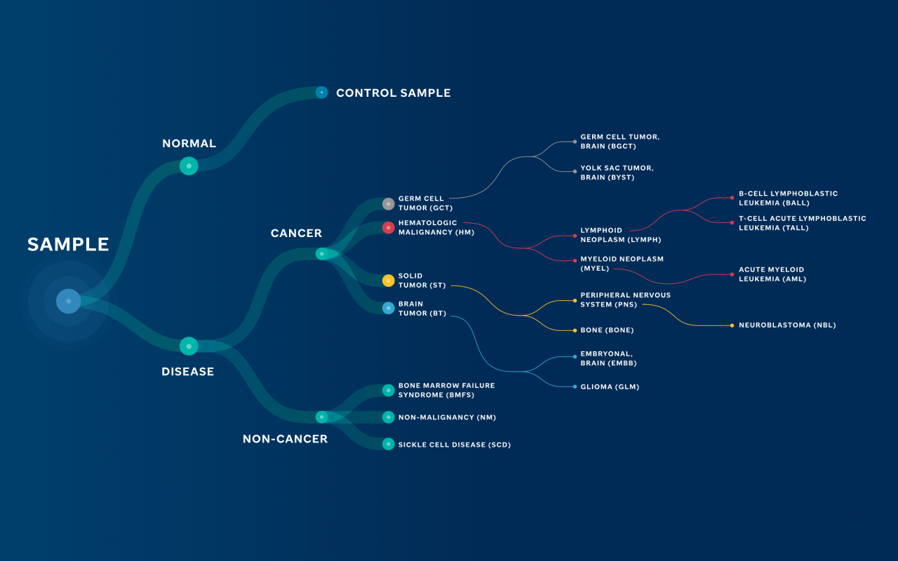

[DRAFT-WIP May 7th, 2024] [sharepoint version](https://sjcrh.sharepoint.com/:w:/r/sites/Team-StJudeCloudPeCan2/_layouts/15/Doc.aspx?sourcedoc=%7BE6E66741-88FC-46CB-9AC7-994464310217%7D&file=Ontology_whitePaper.docx&action=default&mobileredirect=true)

### The St. Jude Cloud Bespoke Ontology: An Evolving Framework for Pediatric Cancer Research 

## Introduction: 

Ontologies facilitate the development of new conceptualizations of diseases by providing a structured framework for organizing and categorizing complex biomedical data. These ontologies are indispensable in cancer research, revolutionizing data accessibility, interoperability, integration, and interpretation and fostering collaboration among researchers. However, in the realm of pediatric cancer, existing ontologies fall short due to the disease's heterogeneity nature, sparse data availability, and evolving landscape posing significant obstacles to accurately represent its molecular and clinical profiles. Even esteemed frameworks like the World Health Organization (WHO) and Oncotree classifications, primarily catering to adults, persists gaps for a comprehensive ontology capable of integrating pediatric diagnoses. St. Jude Cloud, a cloud-based data sharing platform, currently houses an extensive collection of pediatric genomic, transcriptomic  and histological data. With over 13,000 patient samples amounting to 1.77 petabytes of data, St. Jude Cloud relies on the critical need for an evolving bespoke pediatric ontology and hence initiating the development for its own tailored ontology.  

## History and principles of the development: 

Our ontology originally drew inspiration from the established Oncotree but found that not all nodes were translatable in the pediatric domain, especially at higher nodes. For example, one change from Oncotree was to differentiate between leukemia and lymphoma. Also, our hierarchy’s structure is intentionally simplified and focused solely on the pediatric domain. Another differentiating factor of the bespoke ontology is that many pediatric diseases are driven by rare molecular drivers which became instrumental in delineating subtypes in our ontology. For instance, B-Cell Acute Lymphoblastic Leukemia (BALL) 1 led to the classification of 28 distinct subtypes over time, a substantial increase from Oncotree's current nine. T-Cell Acute Lymphoblastic Leukemia (TALL)1 led to the classification of 10 distinct subtypes, an increase from two on Oncotree. Thus, the inclusion of rare molecular drivers such as DUX42, MEF2D3, and CEBPA/FLT3- or NFATC44 rearrangements, has been included which are important for risk stratification. What examples should we include for brain and solid? 

With each new batch of data that funnels into St. Jude Cloud, our curation team harmonizes by sample and makes revisions as necessary to the bespoke ontology. They curate by employing an integrative approach using histological, pathological, and molecular factors for disease classification which makes the annotations unique from other disease classifications like ICD-O-3 codes, which are primarily focused on morphological factors. 

## Known issues: 
While significant progress has been made, we recognize the need for further improvements. As Oncotree and the WHO make recent updates, one of St. Jude Cloud’s mission is to evaluate new enhancements to better align to these ontologies where applicable.  

I will need guidance on how we want to propose these changes and see if there are any that are missing that we should add.  

### Hematological diseases: 

- For AML, we have developed our own distinctions, as outlined in Alex's annotations. However, it's worth noting that Jeff Klco's paper (https://www.nature.com/articles/s41588-023-01640-3) utilizes different terminology, which requires consideration. How do we want to convey this? 

- Need to review WHO classifications 

- Need to review Oncotree again 

### Brain tumors: 

- The WHO CNS55 classification updated in 2021, and efforts are underway to incorporate these enhancements into our system. 

- Review all glioma tumors: 

- There's a shift from classifying diffuse intrinsic pontine glioma to midline glioma. 

- Furthermore, our ontology significantly distinguishes between anaplastic and diffuse, which deviates from the WHO CNS5 classification (e.g., astrocytoma) 

- Review all embryonal tumors in the context of histological vs molecularly defined: 

- Recent studies suggest reconsidering the classification of medulloblastoma group 3 and group 4 separately, advocating for annotation as Medulloblastoma, non-WNT/non-SHH6,7.  

- Update Glioblastoma  

### Solid tumors: 

- It's proposed to merge osteoblastic osteosarcoma and chondroblastic osteosarcoma under the umbrella of osteosarcoma.  

- Additionally, we recognize the importance of reviewing WHO solid tumor classifications for any new updates. 

## Conclusion: 

St. Jude Cloud ontology serves as a cornerstone, providing a framework within the pediatric community currently powering applications like the Pediatric Knowledge Base (PeCan). For instance, the pivotal aspect of PeCan is its utilization of the St. Jude Cloud custom ontology to customize the selection of associated data for a cancer subtype of interest via a sunburst navigation interface. Upon selection, a summarized view of available data within each of the 4 data facets is presented, facilitating exploration and inspiring hypothesis generation.  

As the landscape of pediatric cancer research evolves, the St. Jude Cloud ontology remains adaptable and forward-thinking. It is not merely a static framework, but a dynamic framework as new data is collected, studies emerge, and collaborations develop. However, for it to truly thrive and remain relevant, community engagement is essential. We need the input and collaboration of researchers, clinicians, and experts from diverse backgrounds to ensure that the ontology remains comprehensive, accurate, and reflective of the latest advancements in pediatric oncology. Through ongoing engagement with the community, we can collectively contribute to improving outcomes for children battling cancer and catastropic diseases. 

Click [here]() to download the full St. Jude Cloud custom ontology (v1).  

**Contact**: For inquiries, collaborative opportunities, or to provide feedback on improving the St. Jude Cloud ontology, please contact [support@stjude.cloud](support@stjude.cloud). 

### References 
1. https://pubmed.ncbi.nlm.nih.gov/36050548/ 
2.  https://pubmed.ncbi.nlm.nih.gov/27776115/  
3. https://www.ncbi.nlm.nih.gov/pmc/articles/PMC5105166/  
4.  https://pubmed.ncbi.nlm.nih.gov/36050548/  
5. https://link.springer.com/article/10.1007/s00701-022-05301-y 
6. https://www.biorxiv.org/content/10.1101/2024.02.09.579680v1.full 
7. https://www.ncbi.nlm.nih.gov/pmc/articles/PMC8833659/ 