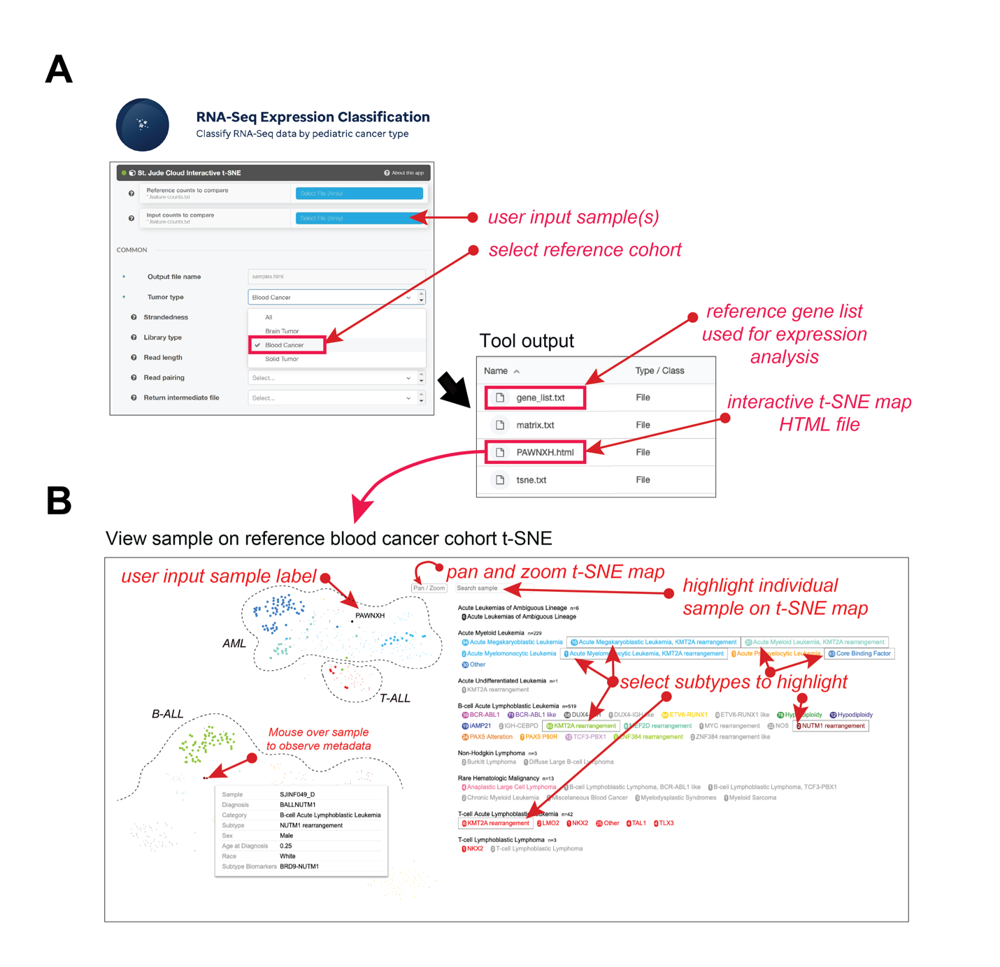

**Overview:** The expression landscape of 1,574 RNA-Seq fresh frozen tumor samples (816 blood cancers, 302 solid tumors, and 447 brain tumors) in St. Jude Cloud is displayed via a t-SNE plot (Figure 1) generated using the [St. Jude Cloud RNA-Seq Expression Analysis workflow](https://platform.stjude.cloud/workflows/rnaseq-expression-classification) (Figure 2). Visualization representatives are found in [Figure 4f of McLeod et al](https://cancerdiscovery.aacrjournals.org/content/11/5/1082.long). 

**Figure 1:** [Interactive tSNE for Blood, Brain, and Solid Samples](https://viz.stjude.cloud/st-jude-childrens-research-hospital/visualization/pediatric-blood-solid-and-brain-tumor-rna-seq-t-sne-plot-1574-samples~24). Further details for each sample can be accessed by mousing over the dots and by accessing the associated [metadata](https://platform.stjude.cloud/api/v1/manifest). This visualization is supported by ProteinPaint.

### Methods

**Figure 2:** [St. Jude Cloud RNA-Seq Expression Analysis workflow](https://platform.stjude.cloud/workflows/rnaseq-expression-classification) enabling clustering user-supplied RNA-Seq data with a St. Jude Cloud pediatric cancer cohort via an interactive two-dimensional t-SNE plot. **(A)** User interface for selecting user sample(s), parameters for analysis and pediatric cancer type (which can be one of ‘blood’ (selected in this example), solid, brain, or all reference cohort). If the input is a BAM file, realignment to hg38 using our inhouse RNA-Seq alignment protocol is used to generate gene counts. The user gene counts are then collated with the reference gene count data and expression analysis is performed. The genes used for the t-SNE analysis are available as a `gene_list.txt` and t-SNE plot as `PAWNXH.html` (PAWNXH is the COG sample used as an example for use case 1). **(B)** t-SNE plot of blood cancer samples where the user sample (i.e. PAWNXH) is clustered with the St. Jude Cloud AML samples.  A user may Pan/Zoom the t-SNE plot, query a sample of interest, and highlight subtypes of interest by clicking on the cancer subtype label on the right. The current display highlighted 1) samples of KMT2A rearrangements in all subtypes of blood cancers, 2) AML Core Binding Factor and 3) B-ALLs with NUTM1 fusions. Mouse over a tumor sample displays the associated metadata for the sample, in this instance SJINF049_D, a B-ALL with BRD9-NUTM1 fusion. 

### Data
The data to re-create the tSNE is found here on [St. Jude Cloud's Genomics Platform](https://platform.stjude.cloud/data/publications?selected_tags=SJC-PB-1020). 
