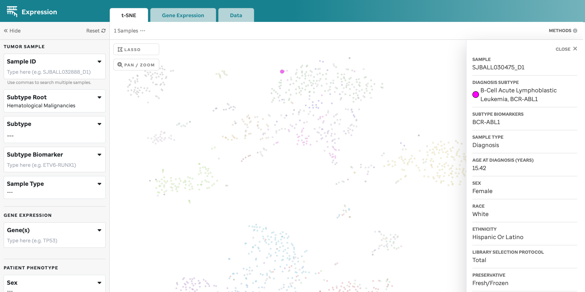
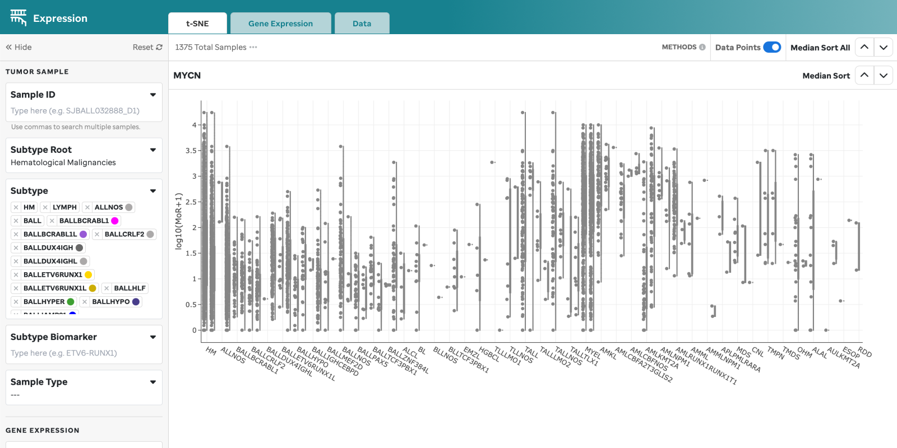
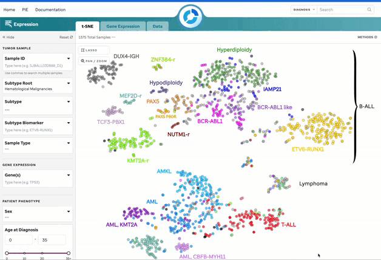
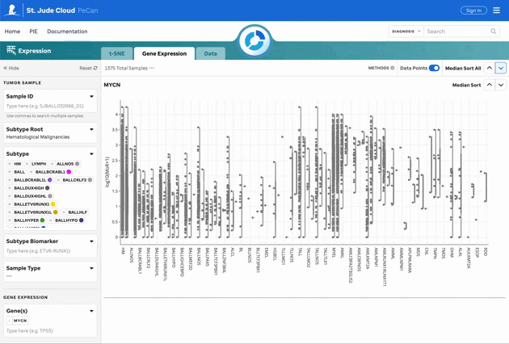
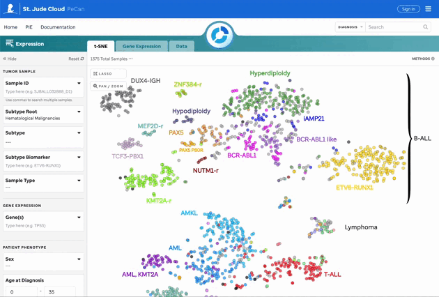
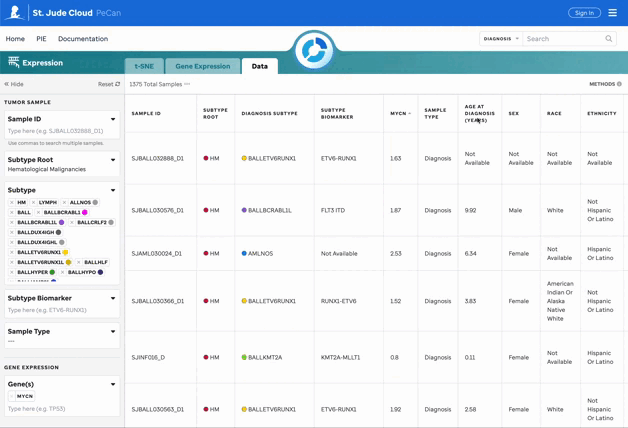

## Overview

This facet comprises three tabs, allowing users to explore the expression landscape of 3,432 RNA-Seq fresh frozen tumor samples (1,389 blood tumors, 888 solid tumors, and 1,155 brain tumors) using a t-SNE plot (**Figure 1**), gene expression violin plots organized by subtype for a gene of interest (**Figure 2**), gene expression overlayed on the t-SNE, or collectively within a data matrix.

**Figure 1: t-SNE for Blood, Brain, and Solid Samples.** Mouse over data points to access metadata details for each sample. Visualization powered by D3.

**Figure 2: Gene Expression for TP53.** Gene expression violin plots for each sample, filtered by the gene of interest. Visualization powered by Plotly.

> **Note**
> - All samples use the hg38 reference genome.
> - Full metadata can be accessed through our [manifest](https://platform.stjude.cloud/api/v1/manifest).

---

## Features for the t-SNE Plot

| Feature                    | Description                                                                                               |
| -------------------------- | --------------------------------------------------------------------------------------------------------- |
| **Subtype Categorization** | Subtypes are color-coded, and a subset is labeled on the plot. These can be turned off in the 3 dot menu. |
| **Sample Summary**         | Clicking a data point opens a drawer with metadata and sample details.                                    |
| **Filters**                | Filters are categorized by Tumor Sample, Patient Phenotype, and Sample Preparation.                       |
| **Sample Search**          | Search by individual or bulk (comma-separated) sample IDs. CompBio IDs must be exact.                     |
| **Lasso Tool**             | Select a region on the plot to retrieve a list of samples for further investigation.                      |
| **Pan/Zoom**               | Zoom in or pan to examine specific regions of the plot. This will disable subtype labels.                 |

> **Warning**
> Filtering by the sunburst will auto-populate the Root and Subtype filters. These can be manually edited but will not update the sunburst.

---

## Features for Gene Expression

| Feature              | Description                                                                                  |
| -------------------- | -------------------------------------------------------------------------------------------- |
| **Gene Sandbox**     | Violin plots for the gene of interest, filtered by root and subtypes.                        |
| **Plotly Functions** | Pan and zoom features on the right side of the gene sandbox do not affect filter components. |
| **Median Sort**      | Sort the gene expression sandboxes by median expression across or within individual groups.  |
| **Outlier Toggle**   | Toggle off data points to keep outliers intact for the cohort currently being filtered.      |

For data normalization details, refer to our [Methods and Data](https://university.stjude.cloud/docs/pecan/methods-data/) page.

---

## Gene Expression Overlay on t-SNE

Users can overlay gene expression on the t-SNE plot by selecting genes of interest. Count data is normalized using Median of Ratios (MoR). More details can be found on the [Methods and Data](https://university.stjude.cloud/docs/pecan/methods-data/) page.

---

## Features for the Data Matrix

The data matrix displays all filtered data with sortable headers for easier exploration.

---

## Filters Explained

### Tumor Sample

| Filter                | Description                                                                                                                                     |
| --------------------- | ----------------------------------------------------------------------------------------------------------------------------------------------- |
| **Sample ID**         | Search by individual or bulk St. Jude CompBio IDs (comma-separated). Allows multi-select.                                                       |
| **Subtype Root**      | Custom-select a root to prompt applicable subtypes. Heme is defaulted upon loading the facet unless the sunburst is employed.                   |
| **Subtype**           | Custom-select subtypes to view on the plot. Parent node selection enables or disables child nodes.                                              |
| **Subtype Biomarker** | Multi-select subtype biomarkers to apply on the plot. General genes like "CTNNB1" are not accepted; users must select biomarkers from dropdown. |
| **Sample Type**       | Multi-select dropdown for sample types.                                                                                                         |

### Patient Phenotype

| Filter               | Description                                        |
| -------------------- | -------------------------------------------------- |
| **Sex**              | Multi-select dropdown for biological sex.          |
| **Age at Diagnosis** | Adjustable scale or manual input for age in years. |
| **Race**             | Multi-select dropdown for race.                    |
| **Ethnicity**        | Multi-select dropdown for ethnicity.               |

### Sample Preparation

| Filter                         | Description                                          |
| ------------------------------ | ---------------------------------------------------- |
| **Library Selection Protocol** | Multi-select dropdown for library protocol types.    |
| **Preservative**               | Multi-select dropdown for sample preservative types. |

> **Warning**
> Some fields may have a "Not Available" option for samples where the data wasn't recorded (e.g., Race, Ethnicity, Sex).

> **Tip**
> For a subset of this data, refer to [Figure 4f of McLeod et al.](https://cancerdiscovery.aacrjournals.org/content/11/5/1082.long)

---

To see how the data was calculated and normalized, visit our [Methods and Data](https://university.stjude.cloud/docs/pecan/methods-data/) page.
