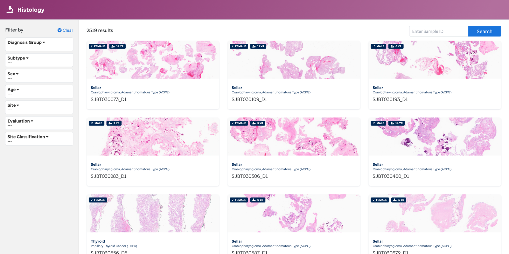

**Overview:** The COMET project is comprised of 5,000 solid tumor samples that have both methylation profiling and histology imaging done. Thus, the expected counts of both histology slides and methylation arrays in 5,000 files. All histology slides are H&E stained and have been harmonized. There are 60+ subtypes within this model. The user can explore slides by filtering, explore individual slides across timeframes (if applicable), and visualize/analyze slides using OpenSeaDragon features. 

## ADVANCED SEARCH 

The Histology homepage (Figure 1) will comprise an advanced search page enabling filtering of slides via metadata--diagnosis, subtype, sex, age, site, evaluation, site classification-- via drop-down lists. The functionality of the filter will be optimized in the future. Present search results as a list of slide image thumbnails with age and sex metadata. Sample IDs can be searched individually. 

**Figure 1:** Advanced Search. A user can select Diagnosis/Subtype to filter the database of histology slides provided by COMET. 

## SAMPLE SLIDE IMAGE  

This view (Figure 2) enables access to each histology slide via a “sample slide page.” The clinical report data is given. Additionally, a full thumbnail of the slide with the applicable given patient timeline is shown. A user can analyze the slide by clicking the Open Viewer button, copying the URL to share, or downloading the slide for further analysis.  

**Figure 2:** Sample Slide Image. Preview of the slide with clinical report data. Some slides will display a timeline at the top which is interactive to toggle between slides.  

## OPEN SLIDE VIEWER 

This view (Figure 3) enables the exploration of a sample slide via a slide image viewer page. It displays slide image attributes: magnification, stain, zoom, and scale. OpenSeaDragon functions exist on the left. Home: refreshes the slide to the original state; Magnify+: Zoom in; Magnify-: zoom out; Rotate left: rotates slide 90 degrees left; Rotate right: rates slide 90 degrees right; Patch: add annotations (cannot be saved/shared); Trash: delete annotations; Disable: Hide annotations.  

**Figure 3:** OpenSeaDragon Analysis. Using the OpenSeaDragon functionality enables deep exploration within the slide.  

### Methods

All slides come off the microscope using HNE staining which are then imported into Azure. Currently, there is only 1 slide per sample being presented. In the future, there will be use cases where a sample may have multiple slides associated to the same sample ID. 

### Data

All data is shared from the [COMET Blue Sky Initiatve](https://www.stjude.org/research/initiatives/blue-sky.html) led by [Dr. Mike Dyer](https://www.stjude.org/directory/d/michael-dyer.html). Slides are downloadable in PeCan in this Histology Data Facet. 

COMET: Solid tumor 
**CO**mprehensive **MET**hylation

**Goal**: Develop the definitive global database of pediatric solid tumor DNA methylation and copy number profiles using the Illumina Infinium 850K array. 

**Impact**: In addition to being the largest and most comprehensive pediatric solid tumor epigenetic reference dataset in the world, the COMET database will provide another tool to stratify patients on clinical trials, to more effectively classify difficult cases and to accelerate basic science on the origins of pediatric solid tumors. 