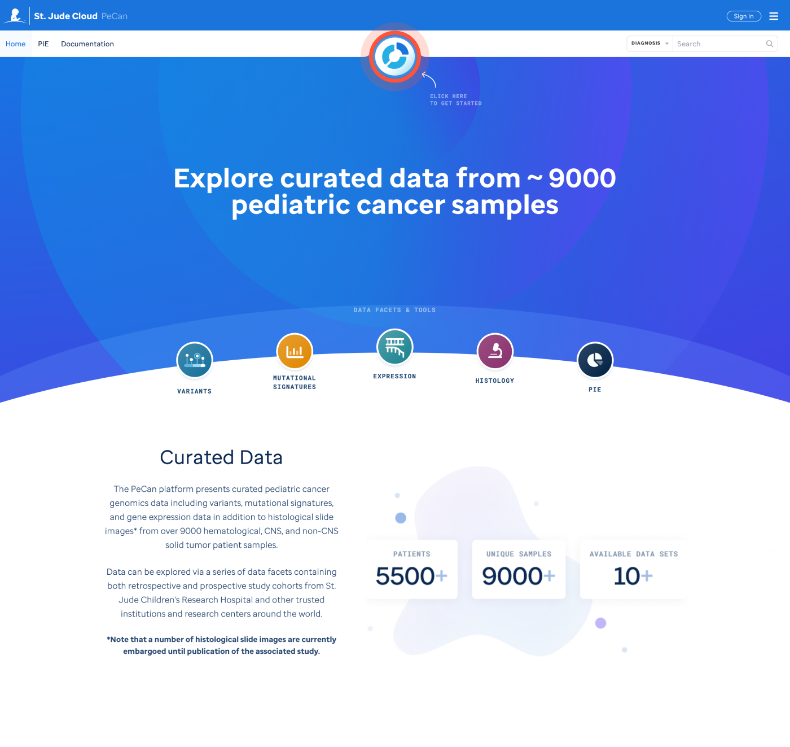

The (Beta) PeCan platform presents curated pediatric cancer genomics data including variants, mutational signatures, and gene expression data in addition to histological slide images from over ~9000 hematological, CNS, and non-CNS solid tumor patient samples.

Data can be explored via a series of data facets containing both retrospective and prospective study cohorts from St. Jude Children's Research Hospital and other trusted institutions and research centers around the world such as [TARGET](https://ocg.cancer.gov/programs/target), [DKFZ](https://www.dkfz.de/en/index.html), and many others. Learn more about the data [here](https://university.stjude.cloud/docs/pecan/data/).

# Homepage
The [PeCan homepage](https://pecan.stjude.cloud/) showcases key components for each of the 4 data facets --Variants, Mutational Signatures, Expression, and Histology--, and the tool: PIE (Pediatric Cancer **P**athogenicity variant **I**nformation **E**xchange).

To get started (**Figure 1**), click our navigational membrane which navigates the user to our sunburst and data facets or search a gene or variant.

**Figure 1: HomePage.** A user can become familiar by reading the key components that is offered in the PeCan Knowledge Base. Additionally, a user can navigate by using our navigational membrane or begin searching a gene or variant of interest.

# Sunburst
The sunburst plot gives an at-a-glance disease distribution and disease hierarchy where all samples have been mapped to a custom ontology (**Figure 2**).
This interactive interface updates as a user selects a diagnoses or subtype within in the sunburst. 

The diseases are categorized in three main root categories: **1)** HM -Hematopoietic Malignancies, **2)** BT -Brain Tumor, and **3)** ST -Solid Tumor. A user is encouraged to navigate via a subtype-centric experience by selecting a subtype and then navigate to each data facet for that available data. This will enable custom interface views per data facet based on the sunburst selection. Alternatively, a user can explore all of the available data within a data facet by clicking directly on the data facet icon instead of filtering by subtype on the sunburst.

**Figure 2: Sunburst Interfacet.** A user is able to filter by diagnoses and/or subtype by selecting the interactive sunburst or by navigating directly into a data facet for the available data.

# Data Facets explained
Data Facets represent a distinct type of post-processed genomic data for collections of pediatric cancer samples via a designated interface.

  

    
  

  

    <h5 class="font-bold"><a href="https://university.stjude.cloud/docs/pecan/variants/"class="text-blue-primary">Variants</a></h5>
    
Visualizations to showcase variant data in an Oncoprint format, Variant Prevalence display, GenomePaint view, ProteinPaint view and designated variant details pages.

  

  

    
  

  

    <h5 class="font-bold"><a href="https://university.stjude.cloud/docs/pecan/mut-sigs/"class="text-blue-primary">Mutational Signatures</a></h5>
    
Samples depicted via a heatmap where COSMIC mutational signatures in pediatric cancer subtypes were analyzed by WGS.

  

  

    
  

  

    <h5 class="font-bold"><a href="https://university.stjude.cloud/docs/pecan/expression/"class="text-blue-primary">Expression</a></h5>
    
An expression landscape of RNA-Seq fresh frozen tumor samples.

  

  

    
  

  

    <h5 class="font-bold"><a href="https://university.stjude.cloud/docs/pecan/histology/"class="text-blue-primary">Histology</a></h5>
    
Solid tumor samples that have histology imaging (all H&E).

  

  

    
  

  

    <h5 class="font-bold"><a href="https://university.stjude.cloud/docs/pecan/epigenetic/"class="text-blue-primary">Epigenetic <small>(coming soon)</small></a></h5>
    
Solid tumor samples with methylation profiling that have linked histology images.

  

# Tools

  

    
  

  

    <h5 class="font-bold"><a href="https://university.stjude.cloud/docs/pecan/pie/"class="text-blue-primary">PIE (the <strong>Pe</strong>diatric <strong>Can</strong>cer Variant <strong>P</strong>athogenicity <strong>I</strong>nformation <strong>E</strong>xchange</a></h5>
    
is a cloud-based variant classification and interpretation service.

  

!!!tip
Looking for the legacy PeCan Help Guides? [Go here.](https://university.stjude.cloud/docs/legacy)
!!!