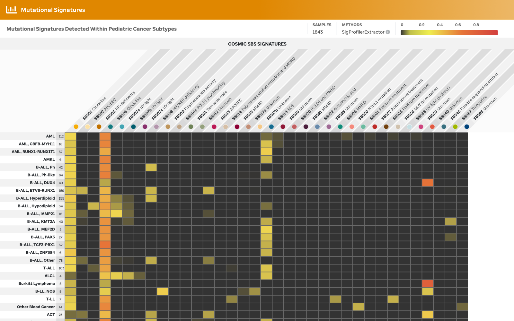
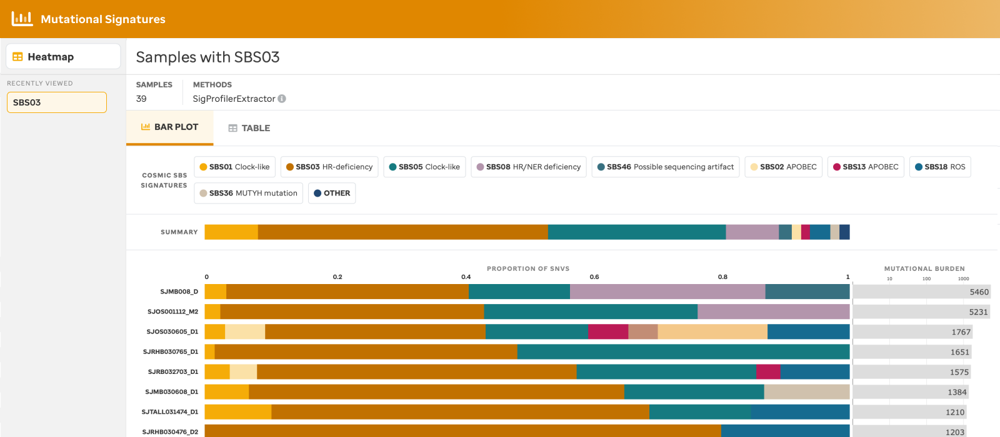
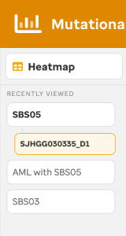
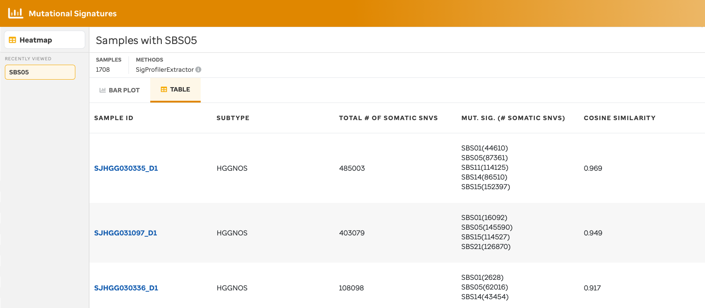
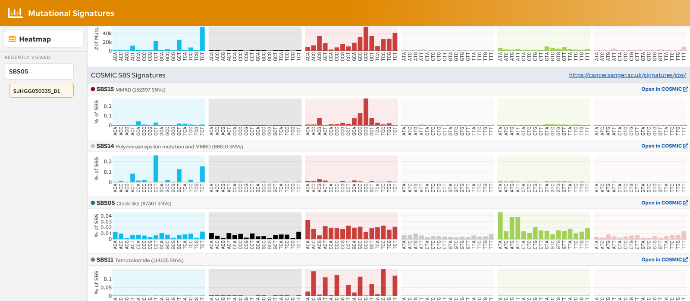

**Overview**
Analysis of samples from St. Jude Children's Research Hospital, specifically from PCGP, Clinical Pilot, and G4K were demonstrated originally in the [Figure 5 of McLeod et al](https://cancerdiscovery.aacrjournals.org/content/11/5/1082.long). Now, Real-time Clinical Genomics samples have been incorporated into the visualization. These samples are depicted via a heatmap where COSMIC single base substitution (SBS) mutational signatures in pediatric cancer subtypes were analyzed by WGS.

## HEATMAP VIEW
Identification of COSMIC SBS signatures (v3.1) upon consideration of WGS somatic variants were performed using SigProfilerSingleSample (v1.3) across 790 samples (Figure 1). The user can explore a sample summary bar plot view by clicking the subtype (x-axis), SBS signature (y-axis), or the subtype with a patricular SBS signature (cell).

**Figure 1:** Heatmap View. The heatmap is comprised of sample data and COSMIC SBS mutational signatures that have greater than 0.8 cosine similarity.

## BAR PLOT VIEW
A user can view a sample summary bar plot consisting of the mutational signatures within a given sample in 3 separate ways: 1) samples by subtype (Figure 2), 2) samples by the COSMIC mutational signature (Figure 3), or 3) samples for a specific subtype with a specific mutational signature (Figure 4). Each bar plot provides a title, the total number of samples, the method used to identify the mutational signatures, the summary of mutational signatures, the summary of mutational signatures per sample, and the mutational burden per sample. Additionally, clicking the mutational signature legend will provide summary data (e.g., total number of SNVs and % within that sample) and a link to the COSMIC website. Moreover, clicking the mutational burden per sample also provides a summary fo the sample name and total number of SNVs found within that individual sample.

**Figure 2:** Subtype Selection from Heatmap View. This view allows a user to investigate COSMIC mutational signature summaries and mutational burden per sample cohort of a given subtype.

**Figure 3:** COSMIC SBS Selection from Heatmap View. This view allows a user to investigate mutational signature summaries and mutational burden per sample cohort of a given SBS.

**Figure 4:** Subtype with a specific COSMIC SBS Selection from Heatmap View. This view allows a user to investigate mutational signature summaries and mutational burden per sample cohort of a given subtype with a specific COSMIC mutational signature.

**Figure 5:** Recently Viewed. This functionality exists to allow the user to cache the last 5 samples per selection from the user experiences explained in Figures 2-3. This can be helpful when analyzing samples together. Once the 6th sample is selected for that cohort, the first sample selected is removed, therefore the queue follows a first in last out methodology. The user can also remove samples individually (see hover x in the image) or a user can remove all samples by selecting the hover X button per header.

## TABLE VIEW
A table view (Figure 6) is also available for each barplot view so that a user can see the same information as the bar plot view but in a tabular manner. Sample ID, subtype, the total number of somatic SNVs, the existing mutational signature per sample, and the cosine similarity are given.

**Figure 6.** Table View: The table view is an alternative to the barplot view for each use case described in Figures 11-13.

A user can select a mutational signature (column 4) and see a summary or the call to action to the COSMIC website.

## SAMPLE VIEW
By selecting an individual sample, the user will navigate to a sample page view (Figure 7-8), this provides the number of mutations per codon for each base pair change. The sample metadata – diagnosis, data type, total somatic SNVs, and reference genome – is given in the top right. The colors per base change are related to the COSMIC website. Additionally, each SBS mutational signature COSMIC depiction is given as a reference with a link to the website.

**Figure 7:** Sample View. Mutations for each codon by base change for a particular sample with the COSMIC mutational signature references underneath.

**Figure 8:** Sample View, COSMIC Mutational Signature Reference. COSMIC mutational signature reference found in the sample to be used as a reference during analysis.

