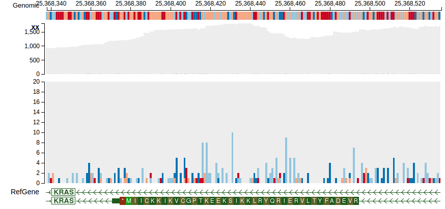

**"Bampile" track**
-------------------



## File format

The file has 3 columns:

1. Chromosome name
2. Basepair position, 0-based
3. JSON object, e.g.
    * {"Raw_0":{"A":8,"C":11,"G":5,"T":4050},"Raw_30":{"A":4,"C":7,"G":4,"T":3966},"Raw_35":{"A":3,"C":7,"G":3,"T":3771},"Raw_38":{"A":1,"C":5,"G":3,"T":3334},"New_0":{"C":4,"T":2652},"New_30":{"C":4,"T":2633},"New_35":{"C":4,"T":2598},"New_38":{"C":2,"T":2382}}
    * Keys are various grades
    * For each grade, read depth for each observed nucleotide is given in an object

## Prepare a track

To prepare bampile track file from Xiaotu's output in St. Jude internal
system:

Node.js v6.0 and above is required. Linux binaries are available at [https://nodejs.org/dist/v6.9.1/node-v6.9.1-linux-x64.tar.xz](https://nodejs.org/dist/v6.9.1/node-v6.9.1-linux-x64.tar.xz)

(Do not load Node.js using "module load", that's outdated)

```bash
module load tabix
cd /research/dept/compbio/common/proteinpaint-dev/tp/ultra
node bampileparse.js SAMPLE.input.txt > tempfile
sort -k1,1 -k2,2n tempfile > SAMPLE
bgzip SAMPLE
tabix -b 2 -e 2 -s 1 SAMPLE.gz
```

This generates two files under "tp/ultra/" directory:
-   SAMPLE.gz
-   SAMPLE.gz.tbi

Link the file to ProteinPaint by URL for display:

[http://proteinpaint-dev.stjude.org:3001/?block=on&genome=**hg19**&position=chr13:48941549-48941948&bampilefile=**SAMPLE,ultra/SAMPLE.gz**](http://proteinpaint-dev.stjude.org:3001/?block=on&genome=hg19&position=chr13:48941549-48941948&bampilefile=SAMPLE,ultra/SAMPLE.gz)

In the URL parameter, set correct genome build version, initial display
position, and name and path to the SAMPLE.gz file.
-   File path should start from but do not contain "tp/".
-   Name and path is joined by comma.
