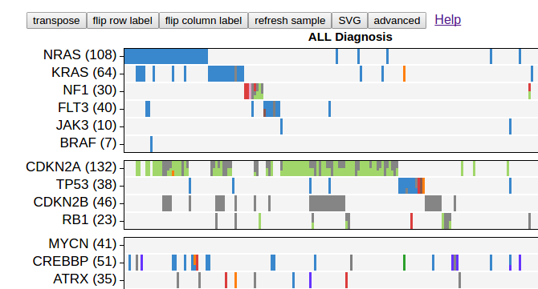
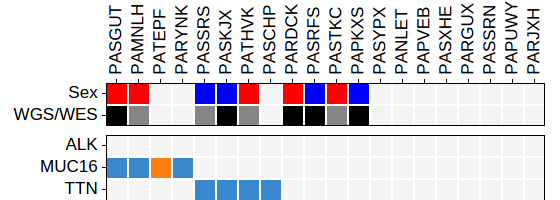
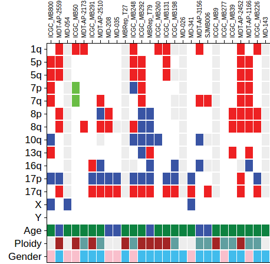
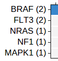

**Using heatmap**

Heatmap is a gene-by-sample grid representing mutations from a data set,
looking like below:



The heatmap can be customized to great extent. Click the button
"advanced" on top:


A box opens on the left showing texts that can be edited. The content is
an JSON object describing the heatmap. Make modification to the JSON
content, click "update" button to render a new heatmap to reflect your
changes.

!!!warning "Save your map before leaving..."

ProteinPaint will not save the JSON when you leave, because
the heatmap is based on user-provided data. If you have
made edits, copy and save the JSON text before leaving
ProteinPaint. Next time you explore the same dataset,
launch the heatmap, and paste your saved JSON in the text
box to re-create the heatmap.
!!!

!!!tip "Show a preconfigured map"

1. A preconfigured map can be stored in the schematics of a study view. [Refer to the "**heatmapJSON**" attribute of the study schematics](https://drive.google.com/open?id=121SsSYiCb3NCU8jz0bF7UujFSN-1Y20b674dqa30iXE)
2. Also in study view, try the "**hard-coded map**" in which you have complete control of what is showing in one or more maps.                                     
3. To embed a map in your website, [use the "studyview" as instructed here](https://docs.google.com/document/d/1KNx4pVCKd4wgoHI4pjknBRTLrzYp6AL_D-j6MjcQSvQ/edit?usp=sharing).
!!!

## Genes

### Sort samples by number of mutation in selected genes

```javascript
{"name": "JAK3", "sortorder": 1 }
```

By applying the "sortorder" attribute to a gene, samples will be sorted
by the descending order of number of mutations in this gene. Samples
with more mutation in this gene will be moved to left (or top).

Value is any number.

Multiple genes can be used for sorting. In such case, the numerical
value determines the precedence of which genes are taken into sorting
(smaller the value, earlier the gene is used).

Samples are sorted within each sample group.

Default applied to all genes.

To disable such sorting, remove the attribute from a gene.

### Gene order

The order of genes is determined by the order of appearance of genes in
each gene group in the heatmap JSON.

```javascript
[ {"name": "JAK2"}, {"name":"PAX5"} ]
```

In this example, JAK2 appears earlier than PAX5.

By default, genes are arranged in descending order of total number of
mutations from all samples.

## Samples

### Sample order

By default, the order of samples are automatically adjusted using the
"sort-by-gene" (described above).

To manually adjust sample order, the sorting-by-gene must be disabled
first. Then edit the order of samples in the sample group section of the
heatmap JSON to take effect.

### Sample group

Samples can be arranged into groups. Space can be applied between groups
and borders can be drawn around each group, so that they appear distinct
visually.

```javascript
{"samplegroup": [
    {
       "name":"sample group 1",
       "lst":[
                {  "name":"sample_1" },
                {  "name":"sample_2"}
        ]
     },
     {
        "name":"sample group 2",
        "lst":[
                {  "name":"sample_3" },
                {  "name":"sample_4"}
         ]
     }
   ]
}
```

This code defines two sample groups, each with two samples.

The "samplegroup" attribute is root-level.

### Refresh sample

You can do this by clicking the "refresh sample" button located on top,
rather than editing the JSON. This is because by default the heatmap
chooses samples by requiring the sample to have at least 1 mutation in
the initial set of genes. Afterwards the set of samples stay unchanged
unless you alter the "samplegroup" contents in JSON.

Sometime when user started using a new gene set different from the
initial set, he/she would like the samples to update accordingly. This
is when the "refresh sample" button comes in handy.

Be careful that refreshing samples and your previous edits on samples
will be lost.

Will be available in the next release.

## Border

### Sample/gene group border

```javascript
{"border":"black",
"borderwidth":1}
```

Add border attribute to either a sample or gene group, and a solid
border in specified color will be drawn enclosing this group.

Optionally provide "borderwidth" attribute to specify the width using
integer value. Default 1.

Default applied to gene group.

## Color

### Heatmap cell background color

```javascript
{"cellbg":"#f1f1f1"}
```

The background fill color for a heatmap cell if there is no data.
Applicable for both data cells and metadata cells. Root-level attribute.
Default provided.

### Sample group background color

```javascript
{"background":"black"}
```

Add background attribute to a sample group. The entire group will show
this background color. Default not applied.

This can be used to generate the look of "borders" around heatmap cells.
The border width will be controlled by row/column spacing.


### Cell background color by sample

```javascript
{"name":"20-PANLJN", "cellbg":"#CCCCCC"}
```

Add the **cellbg** attribute to a sample. All cells belonging to this
sample will use the specified background color instead of the global
background color. Default not provided.

*Will be available soon.*

## `"metadata":[]`

Metadata is used for annotating samples.

This is deprecated. Try to use "**metadatabymatrix**" instead.

**Example**

```javascript
"metadata":[
{"key":"a",
"label":"Sex",
"type":"fill",
"values":{
    "male":"red",
    "female":"blue"
    }
},
{"key":"b",
"label":"WGS/WES",
"type":"fill",
"values":{
    "WGS":"black",
    "WES":"#858585"
    }
}
],
"patientannotation":{
"PARDCK":{"a":"male",  "b":"WGS"},
"PASRFS":{"a":"female","b":"WGS"},
"PASTKC":{"a":"male",  "b":"WES"},
"PASSRS":{"a":"female","b":"WES"},
"PASGUT":{"a":"male",  "b":"WGS"},
"PASKJX":{"a":"female","b":"WGS"},
"PATHVK":{"a":"male",  "b":"WES"},
"PAPKXS":{"a":"female","b":"WGS"},
"PAMNLH":{"a":"male",  "b":"WES"}
},
"metadataborder":"black",
```

**Rendered**



### Metadata terms

```javascript
"metadata":[ ... ]
```

Root-level attribute.

Value is a list, with each metadata term as one element. A term is
defined as an object like below:

```javascript
{
   "key":"term1key",
   "label":"Term name",
   "type":"fill",
   "values":{
       "term1attribute1":"red",
       "term1attribute2":"blue"
    }
 },
```

key: key identifier of this term

label: name to be displayed

type: "fill" only, reserved for future expansion

values: attribute values for this term. Key is attribute name, value is
rendering color.

### Metadata box border and color

```javascript
"metadataborder":"color",
```

Root-level attribute.

If present, draw border around metadata section with given color.

### Width of metadata box border

```javascript
"metadataborderwidth":2,
```

Root-level attribute.

If present, draw border with line of given thickness.

## `"patientannotation":{ }`

Root-level attribute.

For annotating patients or individuals.

To be used along with the "metadata" attribute

Value is a hash, with patient names as keys, and annotations as values.

```javascript
{
   "sample1":{
        "term1key":"term1attribute1",
        "term2key":"term2attribute1",
    },
    "sample2":{ ... },
    ...
},
```

When there is no sample type in the dataset, must use this attribute but
not "sampleannotation".

When there IS sampletype, using this attribute will annotate patients,
but not the separate samples. To annotate samples instead (e.g.
diagnosis/relapse), use "sampleannotation" described below.

## `"sampleannotation":{ }`

Root-level attribute.

For annotating individual samples rather than patients.

To be used along with the "metadata" attribute.

Value is a nested hash, with patient/individual name as level-1 keys,
sample type as level-2 keys, and sample annotations as values.

```javascript
{
   "patient1name":{
        "sampletype1":{
           "term1key":"term1attribute1",
           "term2key":"term2attribute1"
         },
         "Sampletype2":{
                ... annotation to this sample in this patient
         }
    },
    "patient2name":{ ... },
    ...
},
```

## `"metadatabymatrix":{}`

Work in progress!!

Prepare metadata annotation in a spreadsheet and declare it using
"**metadatabymatrix**".

Example:

```javascript
"metadatabymatrix":{
   "annotations":[
      {"text":"matrix data lines"}
   ],
   "terms":{
       "Cytogenetics":{
            "Deletion":{ "label":"Deletion", "color":"#3954a4" },
            "Balanced":{ "label":"Balanced", "color":"white" },
            "Amplified":{ "label":"Amplified", "color":"#ee2123" },
            "NA":{ "label":"NA", "color":"#ededed" },
            "LOH":{ "label":"LOH", "color":"#6abd45" }
        },
        "Age":{
            "infant":{ "label":"Infant", "color":"#3954a4" },
            "child":{ "label":"Child", "color":"#0d8240" },
            "adult":{ "label":"Adult", "color":"#ee2123" },
            "NA":{ "label":"NA", "color":"#ededed" }
        },
        "Ploidy":{
            "diploid":{ "label":"Diploid", "color":"#609fa0" },
            "hyperploid":{ "label":"Hyperploid", "color":"#a32525" },
            "NA":{ "label":"NA", "color":"#ededed" }
        },
        "Gender":{
            "M":{ "label":"M", "color":"#41bcec" },
            "F":{ "label":"F", "color":"#f9bfcc" },
            "K":{ "label":"K", "color":"#f4ec17" },
            "T":{ "label":"T", "color":"#faa419" },
            "NA":{ "label":"NA", "color":"#ccc" }
        }
    }
}
```

Metadata rows "1q" to "Y" belongs to the group "Cytogenetics", as defined in metadatabymatrix.terms:{}.

In the legend, it will show "Cytogenetics" but rather each chromosome arm like 1q, 5p and such.




Example of a matrix viewed in spreadsheet:


Content of this file will be represented as a single string, where
columns are joined by "\t" and lines joined by "\n".

## Others

### Gene recurrence

```javascript
"samplecount4gene":true 
```

Root-level attribute.

If set to "true", gene recurrence will be indicated by the number of
samples:


